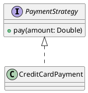

# 🧠 Design Patterns Repository (Kotlin + PlantUML)

This repository is a comprehensive collection of **software design patterns**, implemented in **Kotlin**, with formal modeling using **PlantUML** diagrams.

The goal is to provide a practical, structured, and extensible reference for learning, teaching, and applying design patterns in real-world development.


## 📦 Repository Structure

Each design pattern has what follows:
- PatternX.kt
- PatternXTest.kt
- PatternX.puml
- PatternX.md

Each **pattern** contains multiple **scenarios (at least 3)** to demonstrate different real-world applications or variations.


## 🧩 Covered Design Patterns

### 🏗️ Creational Patterns
- Singleton
- Factory Method
- Abstract Factory
- Builder
- Prototype

### 🧱 Structural Patterns
- Adapter
- Composite
- Decorator
- Proxy
- (Planned / Missing)
    - Bridge
    - Facade
    - Flyweight

### 🔁 Behavioral Patterns
- Strategy
- Observer
- Command
- State
- Template Method
- Iterator
- Visitor
- (Planned / Missing)
    - Chain of Responsibility
    - Mediator
    - Memento

> ⚠️ Missing patterns will be added progressively as the repository evolves.


## 📘 Scenario Structure

Each scenario is a self-contained example including:

### 📄 `README.md`
Explains:
- Problem statement
- Intent of the pattern in this context
- When to use it
- Trade-offs

### 💻 `Main.kt`
Kotlin implementation of the scenario.

### 🧪 `Test.kt`
Unit tests validating behavior using Kotlin test frameworks.

### 📊 `diagram.puml`
PlantUML diagram describing the architecture of the scenario.


## ☕ Kotlin Guidelines

All implementations follow modern Kotlin best practices:

- Idiomatic Kotlin syntax
- Immutable structures when possible
- Use of sealed classes and interfaces where appropriate
- Dependency inversion principles applied where relevant
- Minimal boilerplate, maximum clarity

Example style:

```kotlin
interface PaymentStrategy {
    fun pay(amount: Double)
}

class CreditCardPayment : PaymentStrategy {
    override fun pay(amount: Double) {
        println("Paid $amount using Credit Card")
    }
}
```

# 📐 PlantUML Guidelines

All diagrams are written in **PlantUML** and follow standard UML conventions.


## 🧩 Example



# 📏 Diagram Rules

- Always reflect actual Kotlin structure
- Keep diagrams simple and readable
- Use interfaces, inheritance, and associations clearly
- Avoid unnecessary UML complexity


# 🧪 Testing

Each scenario includes unit tests written in Kotlin.


## 🧪 Testing Principles

- Validate behavior, not implementation
- Cover at least one positive and one edge case
- Keep tests independent and deterministic  

## 🧩 Example

```kotlin
@Test
fun `should pay using credit card strategy`() {
    val payment = CreditCardPayment()
    payment.pay(100.0)
}
```

# 🎯 Goals of This Repository

- Master all classic design patterns
- Understand real-world applicability (not just theory)
- Provide clean Kotlin implementations
- Visualize architecture using UML
- Build reusable mental models for software design


# 🚧 Future Improvements

- Add missing structural and behavioral patterns
- Improve test coverage per scenario
- Add more real-world enterprise examples
- Introduce comparison scenarios (pattern vs pattern)
- Add performance/complexity notes where relevant


# 📚 Recommended Usage

- Study one pattern at a time
- Compare different scenarios of the same pattern
- Recreate scenarios from scratch to internalize concepts
- Modify implementations to simulate real-world constraints


# 🏁 Summary

This repository is not just a catalog of patterns — it is a **hands-on design laboratory for mastering object-oriented design in Kotlin**.
